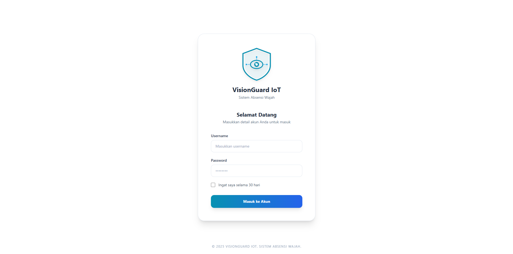
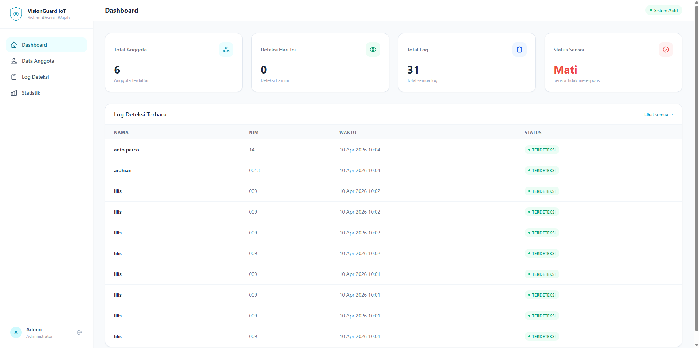
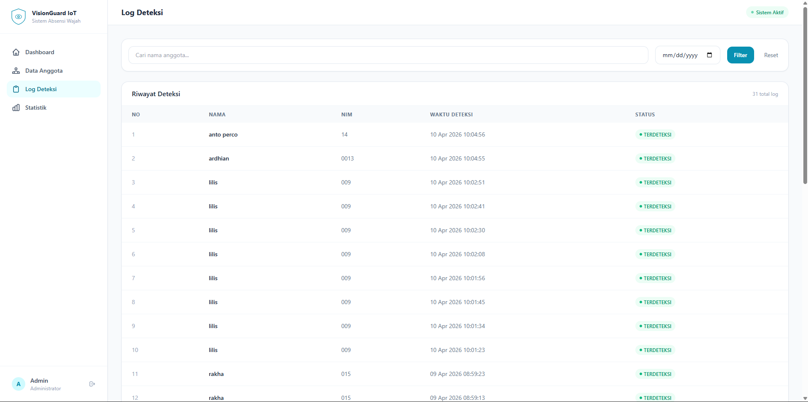
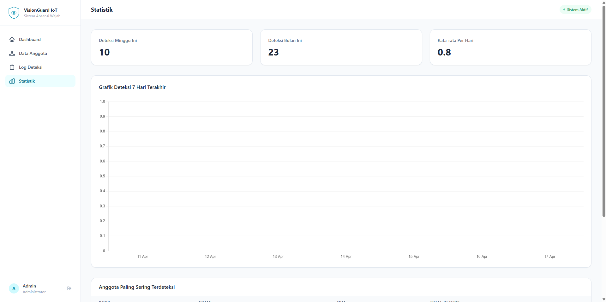

Judul Proyek: Monitoring Wajah Berbasis IoT.
# VisionGuard IoT - Face Recognition System

Fitur: Deteksi wajah real-time dari CCTV, Log otomatis ke database, Dashboard Manajemen Data.
Sistem pemantauan keamanan cerdas berbasis IoT yang mengintegrasikan pengenalan wajah secara real-time dengan dashboard monitoring berbasis web. Proyek ini dirancang untuk memantau individu yang terdaftar melalui kamera CCTV dan sensor hardware.
---

Teknologi: Python, Django, ESP32, OpenCV, dan MySQL
## 📸 Galeri Preview Proyek

### Halaman Login


### Dashboard Utama


### Manajemen Data Anggota


## Tambah Anggota


## Log Deteksi


### Statistik Monitoring



---

## 📌 Deskripsi Proyek
VisionGuard IoT adalah solusi pemantauan yang menggabungkan kemampuan perangkat keras ESP32 dan sensor PIR dengan kecerdasan buatan untuk deteksi wajah. Sistem ini memungkinkan admin untuk mengelola data anggota dan memantau aktivitas akses secara real-time melalui antarmuka web yang modern.

## ✨ Fitur Utama
* **Real-Time Monitoring:** Pemantauan orang melalui web yang terintegrasi secara langsung.
* **Face Recognition:** Mendeteksi dan mengenali wajah orang yang sudah terdaftar dalam database.
* **Manajemen Anggota:** Penambahan, penghapusan, dan pembaruan data anggota melalui dashboard.
* **Detail Anggota:** Informasi lengkap mengenai setiap individu yang terdaftar di sistem.
* **Hardware Integration:** Penggunaan sensor PIR untuk memicu aktivitas kamera dan menghemat daya/sumber daya.

## 🛠️ Tech Stack
* **Backend:** Python, Django Framework
* **Database:** MySQL
* **Frontend:** HTML5, Tailwind CSS
* **AI/ML:** OpenCV, Dlib, Face Recognition Library
* **Hardware:** ESP32 (microcontroller), Sensor PIR (Passive Infrared), CCTV (cam)

## 📋 Prasyarat (Prerequisites)
Pastikan perangkat Anda sudah terinstal:
* Python 3.10+
* MySQL Server
* CMake (diperlukan untuk instalasi library dlib)
* Visual Studio Build Tools (untuk pengguna Windows)

## 🚀 Cara Instalasi

1. **Clone Repository**
   ```bash
   git clone [https://github.com/ardhian26/iot-face-recognition.git](https://github.com/ardhian26/it-face-recognition.git)
   cd iot-face-recognition
   
2. **instalasi libraly**
   pip install django mysqlclient opencv-python face-recognition requests dlib
   
3. **konfigurasi database**
* Buat database di MySQL (misal: db_visionguard).
* Sesuaikan konfigurasi DATABASES pada file settings.py proyek Django kamu.

4. **Migrasi & Menjalankan Server**
  # Melakukan migrasi database
  python manage.py makemigrations
  python manage.py migrate

  # Menjalankan server lokal
  python manage.py runserver

  Akses dashboard di: http://127.0.0.1:8000

# 📂 Struktur Penting
/templates: Folder utama file HTML (Frontend).
views.py: Logika pemrosesan wajah dan integrasi database.
models.py: Struktur tabel MySQL untuk data anggota.